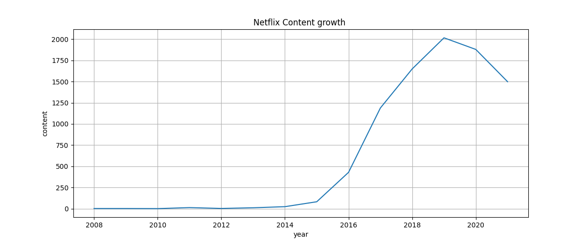
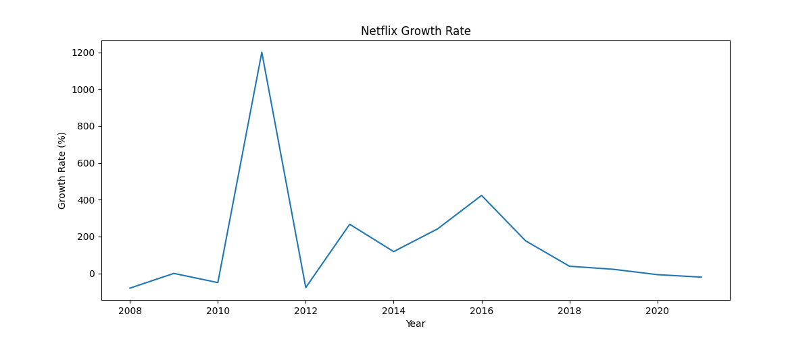
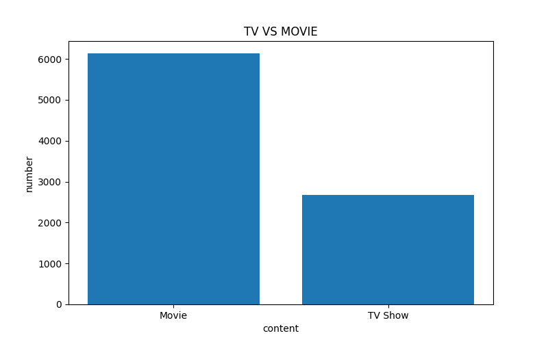
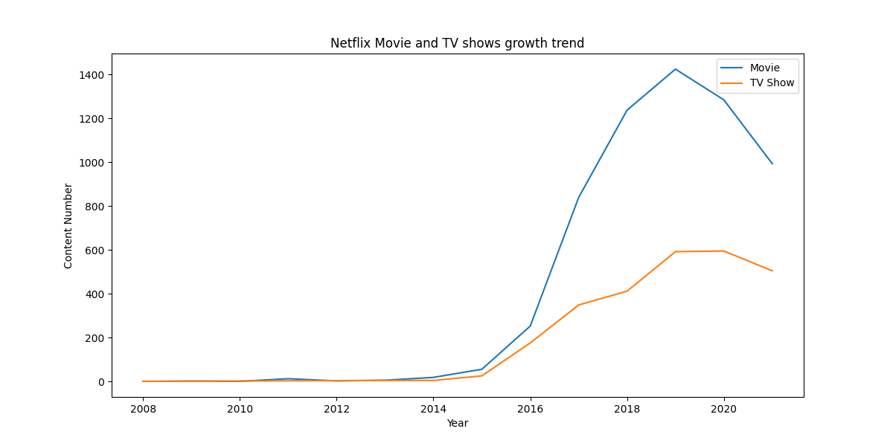

# Netflix Content Growth Analysis

## 项目简介 | Project Overview

本项目基于 Kaggle Netflix 数据集，使用 Python、SQL 和 Power BI 对 Netflix 平台内容增长情况进行数据分析。  
This project is based on the Kaggle Netflix dataset and uses Python, SQL, and Power BI to analyze Netflix content growth trends.

项目主要分析：  
Main analysis includes:

- Netflix 内容增长趋势  
  Netflix content growth trend

- 年增长率变化  
  Annual growth rate changes

- 电影与电视剧数量对比  
  Movie vs TV Show comparison

- 平台发展趋势洞察  
  Platform development insights

该项目主要用于展示数据分析能力，包括：  
This project is designed to demonstrate data analysis skills, including:

- Python 数据清洗  
  Python data cleaning

- SQL 数据分析  
  SQL data analysis

- 数据可视化  
  Data visualization

- 数据业务分析能力  
  Business analysis capability

---

# 数据来源 | Dataset

数据来源：Kaggle Netflix Movies and TV Shows Dataset  
Dataset Source: Kaggle Netflix Movies and TV Shows Dataset

数据字段包括：  
Dataset fields include:

- show_id
- type
- title
- director
- cast
- country
- date_added
- rating
- duration
- listed_in

---

# 使用工具 | Tools

- Python
- Pandas
- Matplotlib
- SQL (SQLite)
- Power BI
- Kaggle Notebook

---

# 项目流程 | Project Workflow

## 1. 数据清洗（Python） | Data Cleaning (Python)

主要清洗内容：  
Main cleaning tasks include:

- 处理缺失值  
  Handling missing values

- 转换日期格式  
  Converting date formats

- 提取年份信息  
  Extracting year information

- 创建分析字段  
  Creating analysis features

```python
df['date_added'] = pd.to_datetime(
    df['date_added'].astype(str).str.strip(),
    errors='coerce'
)

df['year_added'] = df['date_added'].dt.year
```

---

## 2. SQL 增长分析 | SQL Growth Analysis

使用 SQL 对 Netflix 每年新增内容数量进行统计，并计算年度增长率。  
SQL was used to calculate yearly content additions and annual growth rates.

使用到：  
Techniques used:

- GROUP BY
- COUNT()
- LAG()
- Window Function

```sql
WITH yearly_content AS (

    SELECT
        year_added,
        COUNT(show_id) AS total_content

    FROM netflix

    GROUP BY year_added
)

SELECT

    year_added,

    total_content,

    LAG(total_content) OVER (
        ORDER BY year_added
    ) AS previous_year

FROM yearly_content
```

---

## 3. Python 数据可视化 | Python Data Visualization

使用 Matplotlib 绘制：  
Matplotlib was used to create:

- 内容增长趋势图  
  Content growth trend chart

- 年增长率趋势图  
  Annual growth rate trend chart

- 电影 vs 电视剧分析  
  Movie vs TV Show analysis

---

# 项目分析 | Analysis

## 1. Netflix 内容增长趋势分析 | Netflix Content Growth Trend Analysis

Netflix 平台内容数量在 2015 年后快速增长。  
Netflix content volume increased rapidly after 2015.

尤其在 2017-2019 年期间，新增内容数量明显提升，说明平台开始大规模扩张内容库。  
Content additions grew significantly between 2017 and 2019, indicating rapid expansion of the content library.

增长趋势表明：  
The growth trend suggests:

- 平台用户需求快速增长  
  Rapid growth in platform user demand

- Netflix 开始全球化内容布局  
  Netflix expanded its global content strategy

- 原创内容投入增加  
  Increased investment in original content

---

## 2. 年增长率分析 | Annual Growth Rate Analysis

通过 SQL Window Function 中的 LAG() 函数计算年度增长率。  
Annual growth rates were calculated using the SQL Window Function LAG().

分析发现：  
Key findings include:

- 前期增长率较高  
  Higher growth rates during early stages

- 后期增长逐渐稳定  
  Growth gradually stabilized in later years

- 平台进入成熟发展阶段  
  The platform entered a mature development stage

说明 Netflix 已从高速扩张进入稳定运营阶段。  
This indicates Netflix transitioned from rapid expansion to stable operations.

---

## 3. 电影 vs 电视剧分析 | Movie vs TV Show Analysis

数据中电影数量明显高于电视剧数量。  
The dataset shows that movies significantly outnumber TV shows.

说明：  
This suggests:

- 电影内容上线成本较低  
  Movies generally have lower release costs

- 电影更适合快速扩充内容库  
  Movies are more suitable for rapidly expanding the content library

- 电视剧更偏向精品化运营  
  TV shows tend to follow a premium-content strategy

---

# 项目成果 | Key Insights

- Netflix 在 2015 年后进入高速增长阶段  
  Netflix entered a rapid growth stage after 2015

- 平台后期增长趋于稳定  
  Platform growth became more stable over time

- 电影仍是主要内容形式  
  Movies remain the dominant content type

- 美国是核心内容来源国家  
  The United States is the primary content source country

- Netflix 正逐渐推进全球化内容布局  
  Netflix is gradually expanding its global content strategy

---

# 项目截图 | Screenshots

## 内容增长趋势图



---

## 年增长率趋势图



---

## 电影 vs 电视剧分析



---

## 电影 vs 电视剧增长率分析



---

# 技能展示 | Skills Demonstrated

- Python 数据分析  
  Python Data Analysis

- SQL 数据查询  
  SQL Querying

- Window Function

- 数据清洗  
  Data Cleaning

- 数据可视化  
  Data Visualization

- Power BI Dashboard

- 增长分析  
  Growth Analysis

- 业务分析能力  
  Business Analysis Capability

---

# 作者 | Author

麦恒铟
HENGYIN Mai

GitHub Portfolio Project for Data Analyst
